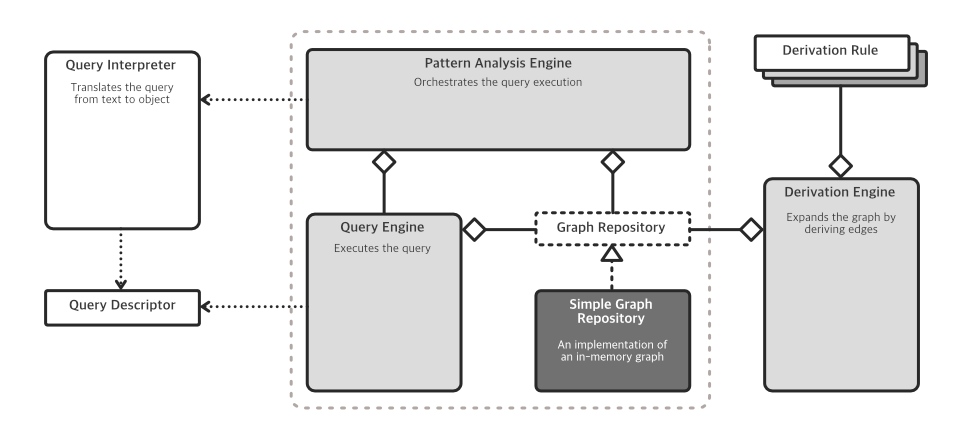
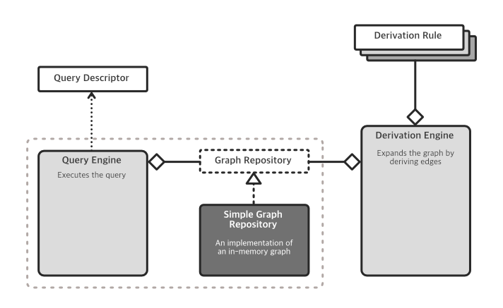
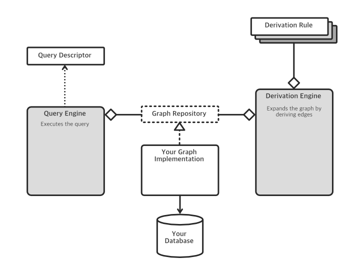

# Pattern Analysis Engine

User-friendly query engine for functional analysis.

## About

This lib was created to provide a customizable pattern analysis engine over any repository type (relational, document,
graph, key-value or column-oriented). Its purpose is to apply rich pattern-matching logic over a graph containing
logical inference edges. It also provides a derivation engine to generate inference edges based on custom rules.

## Installation

Using npm:

``
npm i --save @peritoz/pattern-analysis-engine
``

Using Yarn:

``
yarn add @peritoz/pattern-analysis-engine
``

## Getting Started

This lib provides a modular pattern analysis engine composed of:

- **User-friendly query language (AMAQL)**: Graph query language specialized in pattern analysis and designed to be used
  by non-experts.
- **AMAQL Interpreter**: AMAQL parser engine that is responsible for translating the query from text to object.
- **Query engine**: Executes a query defined by a **Query Descriptor** object.
- **Derivation engine**: Expands the graph by deriving edges (inference edges) based on custom derivation rules.
- **Graph Repository interface specification**: Defines the graph repository contract.
- **In-memory graph repository**: A simple implementation of the graph repository contract.

The Pattern Analysis Engine was designed for partial or full use. Depending on your needs, you can choose not to use
AMAQL and provide a query descriptor directly to the Query Engine. Also, you can implement your Graph Repository and
connect the engine to your database.

### Full Usage Example

The image below describes the Pattern Analysis Engine architecture in full usage.



#### The graph

The following example shows how to use the in-memory Graph Repository to get started quickly.

```ts
import {
    SimpleGraphRepository,
    SimpleGraphVertex,
    SimpleGraphEdge
} from "@peritoz/pattern-analysis-engine";

const graph = new SimpleGraphRepository();

// Adding vertices
// SimpleGraphVertex receives Vertex Name, Types and External Vertex Id
await graph.addVertex(new SimpleGraphVertex("V1", ["t1", "t2"], "1"));
await graph.addVertex(new SimpleGraphVertex("V2", ["t1"], "2"));

// Adding an edge
// SimpleGraphEdge receives Source Id, Target Id, Types and External Edge Id
await graph.addEdge(new SimpleGraphEdge("1", "2", ["et1", "et2"], "E1"));
```

> Note: You can specify your own repository by implementing the *GraphRepository* interface

#### Derivation Engine

If you want to take advantage of the inference engine, you first need to describe all derivation rules that
should be applied to your graph.

A derivation rule is consists of two parts:

1. **Pattern description**: A string describing a relationship pattern to use as a condition for applying the derivation
   rule. As described in the following example:

```
(vType1,vType2)[eType1,eType2]>(vType3)<[]()
```

The pattern described above indicates: Matches any relationship chain that starts with a Vertex of type *vType1* or *
vType2*, which has outbound relationships (of type *eType1* or *eType2*) to Vertices of type *vType3*, which, in turn,
have inbound relationships (of any type) from vertices of any type.

> Note: A Pattern Description is not limited to a two-edge chain. It is also possible to describe more complex patterns
> formed by more than two edges.

2. **Derived edge template**: The derivation rule effect. It describes the edge output that must be created. An example
   is shown below.

```
(3)[eType1](1)
```

The template describes an output edge of type *eType1* that has as source the third vertex and as target the first
vertex, both from the Pattern Description.

> Note: The numbers represent the index (position) of which the element was described in the Pattern Description,
> starting at 1.

The example below shows how to set up and run a derivation engine.

```ts
import {
    DerivationRule,
    DerivationEngine,
    SimpleGraphEdge
} from "@peritoz/pattern-analysis-engine";

const rules = [
    new DerivationRule("()[et1]>()[et2,et3]>()", "(1)[et1](3)"),
    new DerivationRule("(t1)[et2,et3]>()<[et1](t3)", "(2)[et3](1)"),
    new DerivationRule("()<[](t3)[et3]>(t2)", "(3)[et1,et2](1)"),
];

const derivationEngine = new DerivationEngine(graph, rules, (
    sourceId: string,
    targetId: string,
    types: Array<string>,
    externalId: string,
    derivationPath: Array<string>
) => {
    return new SimpleGraphEdge(
        sourceId,
        targetId,
        types,
        externalId,
        derivationPath
    );
});

await derivationEngine.deriveEdges(2);
```

> Note: The method *deriveEdges* receives the number of derivation cycles to be applied over the graph

#### Monitoring the Derivation Process

You can monitor the derivation process execution by injecting a "logger" instance when instantiating the **Derivation Engine**. Your logger class should implement the **Logger** interface:

```ts
interface Logger {
    info: (message: string) => void;
    warn: (message: string) => void;
    error: (message: string) => void;
}
```

The example below shows how to inject your **Logger** implementation when instantiating a **Derivation Engine**.

```ts
import {
    DerivationRule,
    DerivationEngine,
    SimpleGraphEdge
} from "@peritoz/pattern-analysis-engine";

const derivationEngine = new DerivationEngine(graph, rules, (
        sourceId: string,
        targetId: string,
        types: Array<string>,
        externalId: string,
        derivationPath: Array<string>
    ) => {
        return new SimpleGraphEdge(
            sourceId,
            targetId,
            types,
            externalId,
            derivationPath
        );
    },
    new YourLogger() // <- Instantiating your Logger implementation
);
```

#### Creating and using the Pattern Analysis Engine

In order to execute AMAQL queries, you will need to instantiate a **PatternAnalysisEngine**.

The code snippet below presents a basic usage example.

```ts
import {PatternAnalysisEngine} from "@peritoz/pattern-analysis-engine";

const patternAnalysisEngine = new PatternAnalysisEngine(graph);

const result = await patternAnalysisEngine.run('?(t1)->(t2)');
```

The expected result is in the form:

```ts
Array<Array<OutputVertex | OutputEdge>>
```

Where:

```
OutputVertex {
    identifier: string;
    label: string;
    types: Array<string>;
}

OutputEdge {
    identifier?: string;
    direction: Direction;
    types: Array<string>;
    derivationPath?: Array<string>;
}
```

> Note: The query response will be an array of paths that match the pattern described in the query. Because of this, the
> path array will always be a chain of **[VERTEX], ([EDGE], [VERTEX])+**

An example of the expected result is presented below:

```json
[
  [
    {
      "identifier": "1",
      "label": "V1",
      "types": [
        "t1",
        "t2"
      ]
    },
    {
      "direction": 1,
      "types": [
        "et1"
      ]
    },
    {
      "identifier": "2",
      "label": "V2",
      "types": [
        "t1"
      ]
    }
  ]
]
```

### Custom Interpreter Example

There are scenarios in which some customizations are needed. For example, AMAQL might not fit your usage well, or you
want to execute queries directly from the **Query Descriptor** object (perhaps to serve a service) without passing an
AMAQL query string. In these use cases, you can run queries from a **Query Descriptor** object using the **Query
Engine** class. This scenario is shown in the image below.



> Note: For this use, the graph creation and derivation process remains the same.

#### Creating a Query Descriptor

A **Query Descriptor** object describes the entire pattern that should be matched during analysis.
It comprises a query chain composed of an array of Query Triple objects. The example below shows how to instantiate a **
Query Triple** and build a **Query Descriptor**.

```ts
import {
    QueryNode,
    QueryRelationship,
    QueryTriple,
    Direction,
    QueryDescriptor
} from "@peritoz/pattern-analysis-engine";

const leftNode = new QueryNode(
    ["t1"], // Types
    "name", // Search term
    [],     // Node ids. If not empty, the engine will take as baseline all vertices with the given ids
    true    // Should be returned. If false, will be ignored when mounting the output
);
const relationship = new QueryRelationship(
    ["realization"],    // Types
    Direction.OUTBOUND, // Edge direction
    false,              // Is negated
    false               // Is derived. If false, the analysis will not include derived edges
);
const rightNode = new QueryNode(
    ["t2"],
    "another",
    [],
    true
);

const simplePattern = new QueryTriple(
    leftNode,
    relationship,
    rightNode
);

const queryDescriptor = new QueryDescriptor();
queryDescriptor.addTriple(simplePattern);
```

#### Querying by Passing a Query Descriptor Object

To run AMAQL queries passing the newly created **Query Descriptor** object, you will need to instantiate a **
QueryEngine**.

The code snippet below presents a basic usage example.

```ts
import {QueryEngine} from "@peritoz/pattern-analysis-engine";

const queryEngine = new QueryEngine(graph);

const result = await queryEngine.run(queryDescriptor);
```

> Note: The expected output is the same as that returned by the **PatternAnalysisEngine**

### Minimum Usage Example

If high performance is a strong requirement of your use case, implementing a custom repository is highly recommended.
This implementation should implement the **GraphRepository** contract, abstracting any database of your choice. In
addition, it will allow for optimizations tailored to your specific usage scenario.



## The AMAQL Query Language

AMAQL is a custom pattern matching language, designed to be easy to use and an advanced tool for pattern analysis.

You can find more details about AMAQL [here](https://github.com/Diorbert/amaql).


